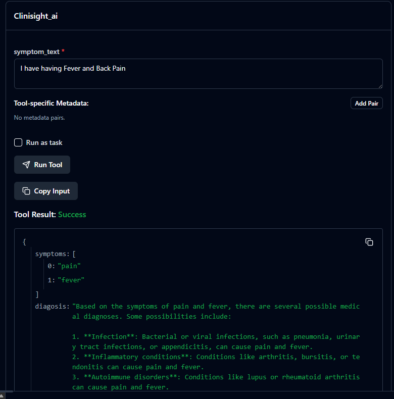

# 🏥 Clinisight - Medical Diagnosis API

AI-powered medical diagnosis API with symptom analysis, diagnosis suggestions, and PubMed research integration.


Workflow Diagram



MCP Inspector

---

## ⚡ Quick Setup (5 Minutes)

### 1. Install Dependencies
```bash
git clone https://github.com/yourusername/clinisight.git
cd clinisight
python -m venv .venv
.venv\Scripts\activate  # Windows
source .venv/bin/activate  # Linux/Mac
pip install -r requirements.txt
```

### 2. Get FREE Groq API Key

1. Visit https://console.groq.com/
2. Sign up (no credit card needed)
3. Go to "API Keys" → "Create API Key"
4. Copy your key (starts with `gsk_`)

### 3. Configure Environment

Create `.env` file in project root
```
GROQ_API_KEY=your_groq_api_key_here
```

### 4. Run the API
```bash
python app.py
```

✅ API running at http://localhost:8080

---

## 🔧 MCP Server Setup

### Install MCP Tools
```bash
# Install MCP dependencies
pip install mcp fastmcp
```

### Run MCP Server
```bash
# Start MCP server
python mcp_server.py
```

### Configure Claude Desktop

**Config File Location:**
- **Windows:** `%APPDATA%\Claude\claude_desktop_config.json`
- **Mac:** `~/Library/Application Support/Claude/claude_desktop_config.json`
- **Linux:** `~/.config/Claude/claude_desktop_config.json`

**Add to config:**
```json
{
  "mcpServers": {
    "clinisight": {
      "command": "python",
      "args": ["C:/Users/YourName/Desktop/Clinisight/mcp_server.py"],
      "env": {
        "GROQ_API_KEY": "your_groq_api_key_here"
      }
    }
  }
}
```

**Replace:**
- `C:/Users/YourName/Desktop/Clinisight/mcp_server.py` with your actual path
- `your_groq_api_key_here` with your Groq API key

### Restart Claude Desktop

After updating config, restart Claude Desktop to load the MCP server.

---

## 📡 API Usage

### Interactive Docs

Visit http://localhost:8080/docs for Swagger UI

### Endpoint: POST /diagnosis

**cURL:**
```bash
curl -X POST "http://localhost:8080/diagnosis" \
  -H "Content-Type: application/json" \
  -d '{"description": "I have fever, headache, and nausea"}'
```

**Python:**
```python
import requests

response = requests.post(
    "http://localhost:8080/diagnosis",
    json={"description": "I have fever, headache, and nausea"}
)
print(response.json())
```

**JavaScript:**
```javascript
fetch('http://localhost:8080/diagnosis', {
    method: 'POST',
    headers: {'Content-Type': 'application/json'},
    body: JSON.stringify({
        description: "I have fever, headache, and nausea"
    })
})
.then(res => res.json())
.then(data => console.log(data));
```

**Response Example:**
```json
{
  "symptoms": ["fever", "headache", "nausea"],
  "diagnosis": "Possible conditions: viral infection, migraine, meningitis...",
  "pubmed_articles": [
    {
      "title": "Fever Management in Adults",
      "abstract": "Study on fever treatment...",
      "authors": ["Dr. Smith"],
      "publication_date": "Jan 2024",
      "article_url": "https://pubmed.ncbi.nlm.nih.gov/12345678/"
    }
  ],
  "pubmed_summary": "Research shows that fever with headache..."
}
```

---

## 🐛 Common Issues

### ModuleNotFoundError
```bash
pip install -r requirements.txt
```

### GROQ_API_KEY Error

Check `.env` file exists and contains:
```
GROQ_API_KEY=gsk_your_actual_key
```

### Port 8080 Already in Use

Change port in `app.py`:
```python
uvicorn.run("app:app", host="0.0.0.0", port=8081, reload=True)
```

### MCP Server Not Connecting

1. Check absolute path in Claude config
2. Verify Groq API key in config
3. Restart Claude Desktop
4. Check MCP server is running

---

## 📦 requirements.txt
```txt
fastapi
uvicorn[standard]
python-dotenv
groq
requests
beautifulsoup4
lxml
pydantic
mcp
fastmcp
```

---

## 📁 Project Structure
```
clinisight/
├── functions/
│   ├── symptom_extractor.py      # Extract symptoms
│   ├── diagnosis_symptoms.py     # AI diagnosis
│   ├── pubmed_articles.py        # Fetch research
│   └── summarize_pubmed.py       # Summarize papers
├── app.py                         # FastAPI server
├── mcp_server.py                  # MCP server
├── .env                           # API key (create this)
├── requirements.txt               # Dependencies
└── README.md                      # This file
```

---

## ⚠️ Medical Disclaimer

**NOT FOR MEDICAL USE** - Educational purposes only. Always consult a healthcare professional.

---

## 🚀 Quick Commands
```bash
# Setup
python -m venv .venv && .venv\Scripts\activate && pip install -r requirements.txt

# Run API
python app.py

# Run MCP Server
python mcp_server.py

# Test API
curl -X POST http://localhost:8080/diagnosis \
  -H "Content-Type: application/json" \
  -d '{"description": "I have fever and headache"}'
```

---

## 📧 Support

- **Docs:** http://localhost:8080/docs
- **Issues:** GitHub Issues
- **Groq Help:** https://console.groq.com/docs

---

**⭐ Star this repo if it helped you!**

Made with ❤️ | MIT License | 2026